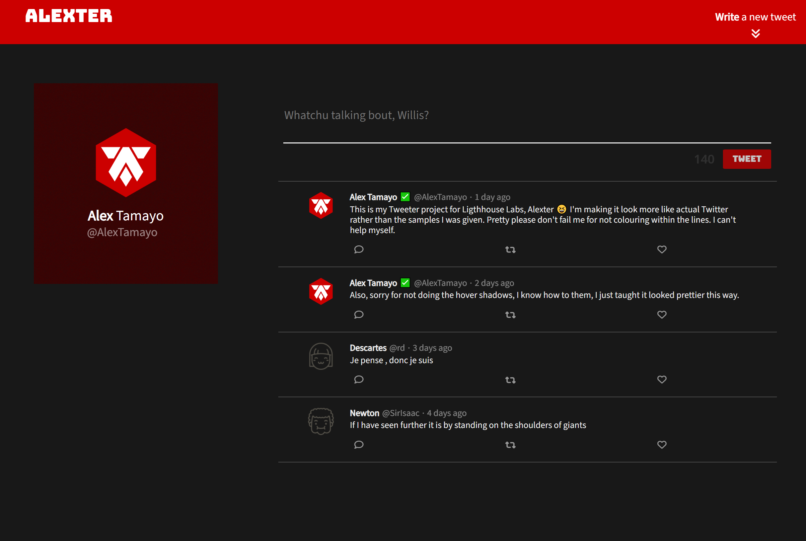
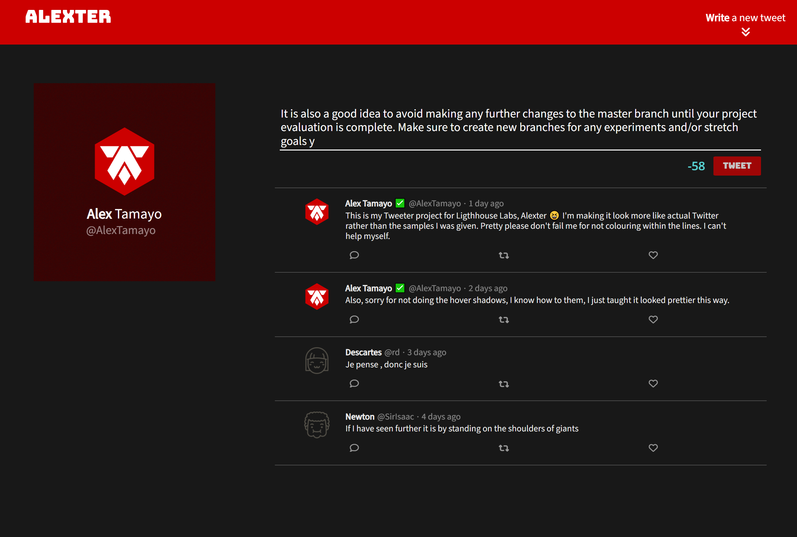
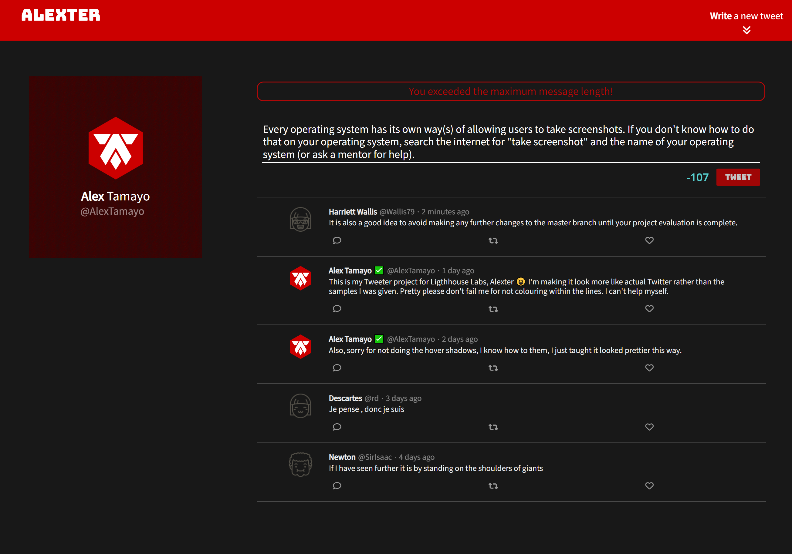
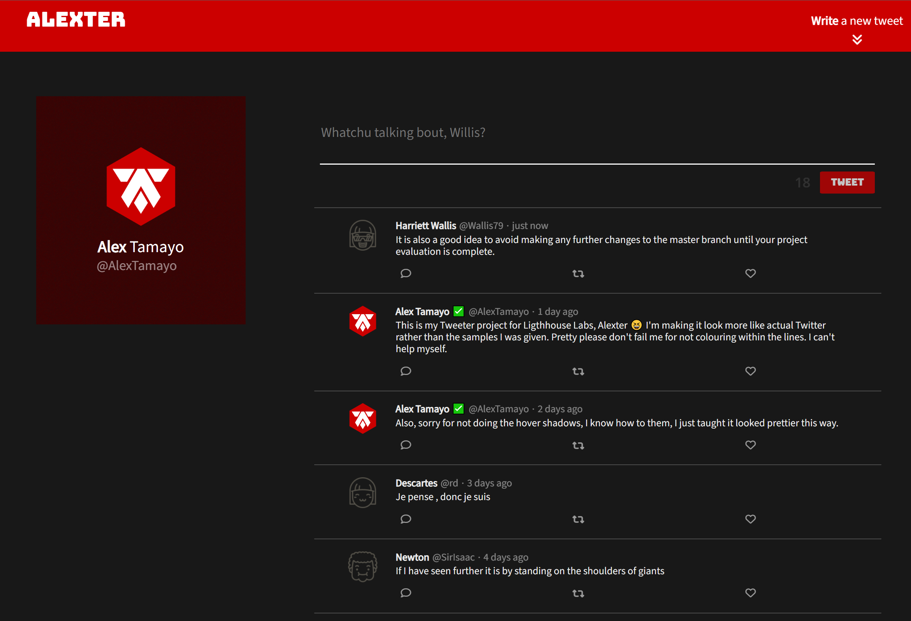
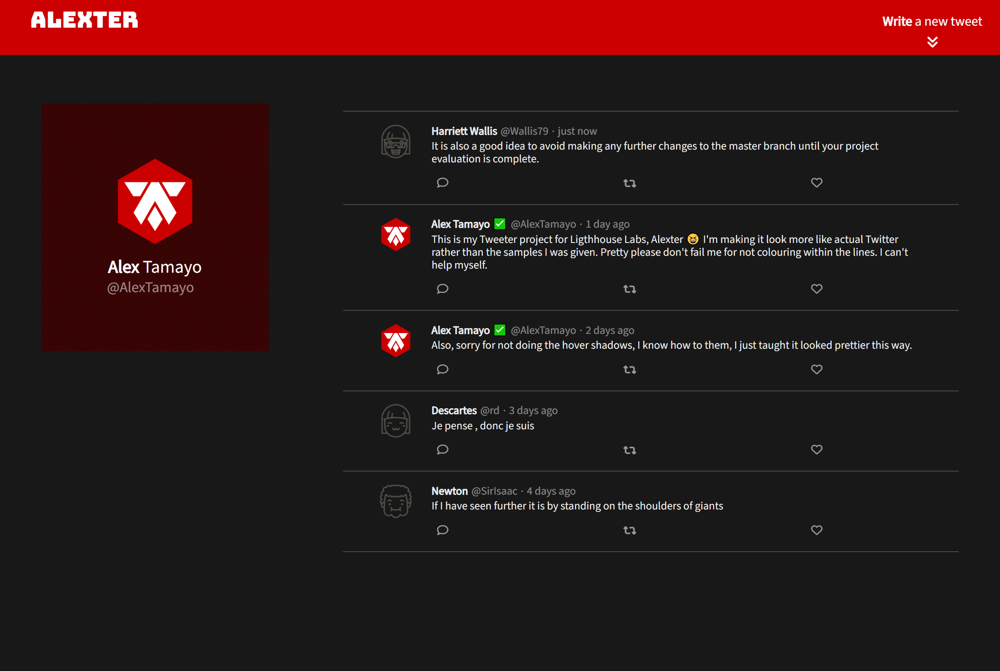
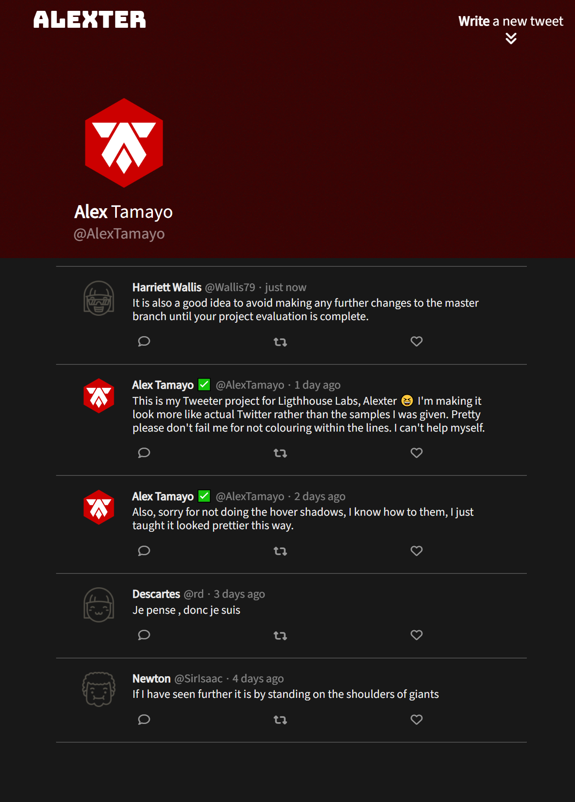

# Alexter Project

## Overview
Alexter is a simplified, single-page application designed to emulate Twitter's basic functionalities. This project serves as a learning scaffold for students who wish to hone their skills in HTML, CSS, JavaScript, jQuery, and AJAX on the front-end, as well as Node.js and Express on the back-end.

## Table of Contents
- [Overview](#overview)
- [Media](#media)
- [Dependencies](#dependencies)

## Media

Visuals are worth a thousand words. Below are some screenshots illustrating various features of Alexter:

- **Video**

  https://github.com/AlexTamayo/Alexter/assets/3316856/447dcc09-b168-431b-b5b8-c21a46723eec

- **Desktop Initial Page**

  

- **Over Character Limit**

  

- **Character Limit Error Message**

  

- **Posted New Tweet**

  

- **Hidden Post Bar**

  

- **Responsive Design**

  

## Dependencies

- Express: For building the web application's server-side logic
- Node.js: v5.10.x or above for executing JavaScript on the server

